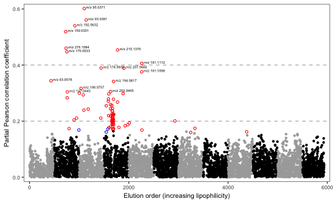

# EPIC metabolomics
This repository puts together R scripts that contain various different workflows for untargeted metabolomics data in the EPIC study.

_Manhattan plot showing results of a metabolome wide association study (MWAS) on coffee intake. Each point represents a spectral feature generated by the mass spectrometer._

#### Description of files

`Feature_match.R` matches features from different untargeted metabolomics feature tables given mass and retention time tolerances.

`Intake_correlation.R` contains a function that performs a metabolome-wide association study for food intake in the EPIC cross-sectional study. Partial correlations are computed between spectral feature intensities and food intakes or lifestyle factors of interest, adjusting for confounders. The output is a data frame consisting of one row per feature, with other information such as median intensity and number of detections also extracted from the feature table. This output is a basis for compound identification, and two further functions use it to generate a correlation matrix or a Manhattan plot.

`Intake_correlation_HCC` does the same as above but for the HCC case-control study.

`Intake_correlation_453_obs.R` is a previous version of the above function that will remain archived.

`Coffee_biomarkers_CS.R` and `Coffee_biomarkers_HCC.R` calculate associations between known coffee intake biomarkers and factors of interest or HCC status in the EPIC cross-sectional and HCC studies respectively.

`Acylcarnitines.R` is an analysis of acylcarnitine plasma intensities extracted from untargeted data. Compounds correlations with food intake are tested and a heatmap plotted. Blood acylcarnitine intensies are also tested for associations with WCRF score.